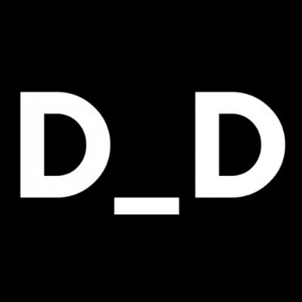

<!-- ALL-CONTRIBUTORS-BADGE:START - Do not remove or modify this section -->
[](#contributors-)
<!-- ALL-CONTRIBUTORS-BADGE:END -->
<!-- LOGO -->

<p align="center">
    <a href="https://developerdao.com">
    
    </a>
    <h2 align="center">DeveloperDAO</h2>
    <p align="center">
    A community of builders who believe in collective ownership of the internet.
    </p>
</p>

[][Discord] [](https://twitter.com/developer_dao) [](https://etherscan.io/token/0x25ed58c027921e14d86380ea2646e3a1b5c55a8b#writeContract)

<!-- Table of Contents -->

<summary><h2 style="display: inline-block">Table of Contents</h2></summary>
<ul>
    <li><a href="#what-is-a-dao">What is a DAO</a></li>
    <li><a href="#what-is-developerDAO">What is  DeveloperDAO</a></li>
    <li><a href="#how-do-i-join">How do I join?</a></li>
    <li><a href="#what-is-this-repo">What is this repo?</a></li>
    <li><a href="#developing">Developing</a></li>
    <li><a href="#contributing">Contributing</a></li>
    <li><a href="#contributors-">Contributors</a></li>
</ul>


## What is a DAO

DAO stands for **D**ecentalized **A**utonomous **O**rganisation. That is a group of people with shared goals/mission that are governed by an agreed set of rules coded into a smart contract(s) on a blockchain.

If you want to learn more about DAOs, check out Cooper Turley's blog at https://alias.co/coopahtroopa/essays, mainly ["The Rise of Micro-Economies"](https://coopahtroopa.mirror.xyz/gWY6Kfebs9wHdfoZZswfiLTBVzfKiyFaIwNf2q8JpgI).

## What is DeveloperDAO

The project was started as an experiment by [Nader Dabit](https://twitter.com/dabit3) to see what can be achieved when we bring together talented and like-minded people who are interested in learning about and building on Web3.

## How do I join?

The DAO operates inside our [discord server](https://discord.gg/ASjBPJuNhS). To gain access to this server you need to own a [Devs for Revolution](https://opensea.io/collection/devs-for-revolution) NFT. The contract for purchasing one [can be found on etherscan.io](https://etherscan.io/address/0x25ed58c027921e14d86380ea2646e3a1b5c55a8b#writeContract). If you're not sure how to mint an NFT, [check out this how-to article](https://jonkuperman.com/how-to-join-developer-dao/) by @jkup.

Whilst there is no charge for the NFT you will have to pay a "gas fee" for the Ethereum Blockchain network in order to mint one. This fee can range wildy from about $40 up to and over $400 at peak times. You can check current gas fee uisng the [Etherum gas price tracker](https://etherscan.io/gastracker). If the fee is high you may want to wait and come back later.

That said, there is a limited supply of NFT's that can be created so don't wait too long!

To find available tokenIDs you can mint try this tool created by the community - https://ddao.ibby.dev/.

If you get stuck please reach out on our [Discord] and we'd be happy to help.

## What is this repo?

This is the code for the [public DeveloperDAO site](https://developerdao.com/).

At the moment it allows members to view their genesis NFT by entering in its ID. As the community takes shape we will decide what this website becomes and build it as a collective.

## Built with

- [React.js](https://reactjs.org/)
- [Next.js](https://nextjs.org/)
- [Chakra UI](https://chakra-ui.com/)
- [Yarn](https://yarnpkg.com/)
- [React Testing Library](https://testing-library.com/docs/react-testing-library/intro/)
- [Prettier](https://prettier.io/)
- [ESLint](https://eslint.org/)
- [Husky](https://typicode.github.io/husky/#/)

## Developing

### Local Development Environment

**Note:** Make sure you have the latest version of node installed `^14.17.6`.

```bash
cd developer-dao;
nvm install; # to install the version in .nvmrc
```

1. Clone this repo with git
2. Install dependencies by running `yarn`
3. Start the development server with `yarn dev`
4. Open development site by going to `http:localhost:3000`

## Contributing

Thanks for showing interest in contributing to Developer DAO. Before submitting any changes please review our contributing gudielines in [CONTRIBUTING.md](./CONTRIBUTING.md).

## Contributors ✨

Thanks goes to these wonderful people ([emoji key](https://allcontributors.org/docs/en/emoji-key)):

<!-- ALL-CONTRIBUTORS-LIST:START - Do not remove or modify this section -->
<!-- prettier-ignore-start -->
<!-- markdownlint-disable -->
<table>
  <tr>
    <td align="center"><a href="https://github.com/aesthytik"><br /><sub><b>Vipin Kumar Rawat</b></sub></a><br /><a href="https://github.com/Developer-DAO/developerdao.com/commits?author=aesthytik" title="Code">💻</a></td>
    <td align="center"><a href="https://thomaslui.me/"><br /><sub><b>Thomas Lui</b></sub></a><br /><a href="https://github.com/Developer-DAO/developerdao.com/commits?author=thomasmetta" title="Documentation">📖</a></td>
    <td align="center"><a href="http://xdrdak.github.io/"><br /><sub><b>Xavier Drdak</b></sub></a><br /><a href="https://github.com/Developer-DAO/developerdao.com/commits?author=xdrdak" title="Code">💻</a> <a href="https://github.com/Developer-DAO/developerdao.com/commits?author=xdrdak" title="Documentation">📖</a></td>
    <td align="center"><a href="https://github.com/aej11a"><br /><sub><b>Andrew Jones</b></sub></a><br /><a href="https://github.com/Developer-DAO/developerdao.com/commits?author=aej11a" title="Code">💻</a></td>
    <td align="center"><a href="https://github.com/nheingit"><br /><sub><b>nheingit</b></sub></a><br /><a href="https://github.com/Developer-DAO/developerdao.com/commits?author=nheingit" title="Code">💻</a></td>
    <td align="center"><a href="https://github.com/Canopix"><br /><sub><b>Emanuel Canova</b></sub></a><br /><a href="https://github.com/Developer-DAO/developerdao.com/commits?author=Canopix" title="Code">💻</a> <a href="#translation-Canopix" title="Translation">🌍</a></td>
    <td align="center"><a href="https://kempsterrrr.xyz/"><br /><sub><b>Will Kempster</b></sub></a><br /><a href="https://github.com/Developer-DAO/developerdao.com/commits?author=kempsterrrr" title="Documentation">📖</a></td>
  </tr>
  <tr>
    <td align="center"><a href="http://cbetz.com/"><br /><sub><b>Christopher Betz</b></sub></a><br /><a href="https://github.com/Developer-DAO/developerdao.com/commits?author=cbetz" title="Code">💻</a></td>
    <td align="center"><a href="https://medium.com/@codingwithmanny"><br /><sub><b>manny</b></sub></a><br /><a href="https://github.com/Developer-DAO/developerdao.com/commits?author=codingwithmanny" title="Code">💻</a> <a href="#design-codingwithmanny" title="Design">🎨</a></td>
    <td align="center"><a href="https://with-heart.me/"><br /><sub><b>with-heart</b></sub></a><br /><a href="https://github.com/Developer-DAO/developerdao.com/commits?author=with-heart" title="Code">💻</a></td>
    <td align="center"><a href="https://kavimaluskam.dev/"><br /><sub><b>Alex Kam</b></sub></a><br /><a href="https://github.com/Developer-DAO/developerdao.com/commits?author=kavimaluskam" title="Code">💻</a> <a href="#translation-kavimaluskam" title="Translation">🌍</a></td>
    <td align="center"><a href="https://github.com/MGrin"><br /><sub><b>MGrin</b></sub></a><br /><a href="https://github.com/Developer-DAO/developerdao.com/commits?author=MGrin" title="Code">💻</a> <a href="#translation-MGrin" title="Translation">🌍</a></td>
    <td align="center"><a href="https://github.com/gjsyme"><br /><sub><b>Greg Syme</b></sub></a><br /><a href="https://github.com/Developer-DAO/developerdao.com/commits?author=gjsyme" title="Code">💻</a></td>
    <td align="center"><a href="https://github.com/Dhaiwat10"><br /><sub><b>Dhaiwat Pandya</b></sub></a><br /><a href="https://github.com/Developer-DAO/developerdao.com/commits?author=Dhaiwat10" title="Code">💻</a> <a href="https://github.com/Developer-DAO/developerdao.com/pulls?q=is%3Apr+reviewed-by%3ADhaiwat10" title="Reviewed Pull Requests">👀</a></td>
  </tr>
  <tr>
    <td align="center"><a href="http://www.acollectionofatoms.me"><br /><sub><b>Adam</b></sub></a><br /><a href="https://github.com/Developer-DAO/developerdao.com/commits?author=ACollectionOfAtoms" title="Documentation">📖</a></td>
    <td align="center"><a href="https://github.com/narbs91"><br /><sub><b>Narb</b></sub></a><br /><a href="https://github.com/Developer-DAO/developerdao.com/commits?author=narbs91" title="Code">💻</a></td>
    <td align="center"><a href="https://bandism.net/"><br /><sub><b>Ikko Ashimine</b></sub></a><br /><a href="https://github.com/Developer-DAO/developerdao.com/commits?author=eltociear" title="Documentation">📖</a></td>
    <td align="center"><a href="https://github.com/moiz-lakkadkutta"><br /><sub><b>moiz-lakkadkutta</b></sub></a><br /><a href="https://github.com/Developer-DAO/developerdao.com/commits?author=moiz-lakkadkutta" title="Code">💻</a></td>
    <td align="center"><a href="https://www.linkedin.com/in/nazeeh-vahora-a48abb196/"><br /><sub><b>Nazeeh Vahora</b></sub></a><br /><a href="https://github.com/Developer-DAO/developerdao.com/commits?author=Nazeeh21" title="Code">💻</a> <a href="#maintenance-Nazeeh21" title="Maintenance">🚧</a></td>
    <td align="center"><a href="https://github.com/miralsuthar"><br /><sub><b>Miral Suthar</b></sub></a><br /><a href="https://github.com/Developer-DAO/developerdao.com/commits?author=miralsuthar" title="Code">💻</a> <a href="#maintenance-miralsuthar" title="Maintenance">🚧</a></td>
    <td align="center"><a href="http://trevorfrench.com"><br /><sub><b>Trevor French</b></sub></a><br /><a href="#translation-TrevorFrench" title="Translation">🌍</a> <a href="https://github.com/Developer-DAO/developerdao.com/commits?author=TrevorFrench" title="Code">💻</a></td>
  </tr>
  <tr>
    <td align="center"><a href="http://marbiano.com"><br /><sub><b>Martin Bavio</b></sub></a><br /><a href="#design-marbiano" title="Design">🎨</a></td>
    <td align="center"><a href="https://linkedin.com/in/davybraun"><br /><sub><b>Davy Peter Braun</b></sub></a><br /><a href="#translation-dheavy" title="Translation">🌍</a></td>
    <td align="center"><a href="https://github.com/nippold"><br /><sub><b>Dennis</b></sub></a><br /><a href="#translation-nippold" title="Translation">🌍</a></td>
    <td align="center"><a href="https://github.com/sijeesh-02"><br /><sub><b>Sijeesh Joshi</b></sub></a><br /><a href="https://github.com/Developer-DAO/developerdao.com/commits?author=sijeesh-02" title="Code">💻</a> <a href="https://github.com/Developer-DAO/developerdao.com/commits?author=sijeesh-02" title="Tests">⚠️</a></td>
    <td align="center"><a href="https://github.com/marcusdiaz"><br /><sub><b>marcusdiaz</b></sub></a><br /><a href="https://github.com/Developer-DAO/developerdao.com/commits?author=marcusdiaz" title="Code">💻</a></td>
    <td align="center"><a href="https://github.com/cmotta"><br /><sub><b>cmotta</b></sub></a><br /><a href="#translation-cmotta" title="Translation">🌍</a></td>
    <td align="center"><a href="https://github.com/rin-st"><br /><sub><b>Rinat Akhunianov</b></sub></a><br /><a href="#translation-rin-st" title="Translation">🌍</a></td>
  </tr>
  <tr>
    <td align="center"><a href="https://nagmakapoor.com"><br /><sub><b>Nagma</b></sub></a><br /><a href="https://github.com/Developer-DAO/developerdao.com/commits?author=nagmak" title="Code">💻</a></td>
  </tr>
</table>

<!-- markdownlint-restore -->
<!-- prettier-ignore-end -->

<!-- ALL-CONTRIBUTORS-LIST:END -->

This project follows the [all-contributors](https://github.com/all-contributors/all-contributors) specification. Contributions of any kind welcome!

## Support
<div>
<a href="https://vercel.com?utm_source=developdao&utm_campaign=oss">

</a>
</div>
<div>
<p align="left">Thanks to Vercel sponsoring this project by hosting it for free</p>
</div>

[Discord]: https://discord.gg/ASjBPJuNhS
